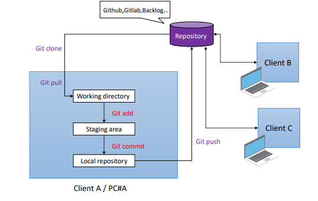

# 1: GIT - Installation
  - Bạn muốn cài đặt Git: 
    + Windows: Bạn có thể cài đặt TortoiseGit, nó là một ứng dụng Git mã nguồn mở.
      (Link: S:\Apps Free\TortoiseGit)
    + Mac: trên máy Mac, bạn có thể sử dụng một ứng dụng khách Git có tên là SourceTree. Nó được tạo ra bởi Atlassian và được sử dụng miễn phí.
      (Link: S:\Apps Free\SourceTree)
  - Nhưng nếu bạn là nhà phát triển( developer) và bạn cảm thấy không thoải mái với giao diện bảng điều khiển. Muốn sử dụng dòng lệnh để hiểu rõ hơn về Git. Tải xuống trình cài đặt Git từ ổ đĩa: S:\Apps Free\Git
## 1.1: Git là gì?
  - Git là một hệ thống kiểm soát phiên bản phân tán (DVCS) để quản lý mã nguồn.
  - Tất cả Code và lịch sử được lưu trữ trên máy tính của người dùng.
## 1.2: Những khái niệm quan trọng.
  - Remote Repository: Kho lưu trữ(repository) là trung tâm(trái tim) của bất kỳ hệ thống kiểm soát phiên bản nào. Nó  là nơi trung tâm nơi các nhà phát triển lưu trữ tất cả công việc của họ. Kho lưu trữ không chỉ lưu trữ các tệp mà còn cả lịch sử. Kho lưu trữ được truy cập qua mạng, hoạt động như một máy chủ và công cụ kiểm soát phiên bản hoạt động như một máy khách.
  - Local Repository: Kho lưu trữ cục bộ được lưu trữ trên máy cục bộ cho một người dùng cá nhân.
  - Commit:Lệnh "commit" được sử dụng để lưu các thay đổi của bạn vào kho cục bộ(local repository) .
  - Branch: Thông thường khi làm việc với Git, Mỗi nhà phát triển sẽ tạo một nhánh(Branch) khác với tổng thể để phát triển một tính năng mới.
# 2: Git hoạt động như thế nào?

## 2.1: Sức mạnh của git.
  - Tính năng  quy trình làm việc theo nhánh(Branch Workflow): 
    + Các nhánh(branches) tính năng cung cấp một môi trường cho mọi thay đổi đối với cơ sở mã.
    + Điều này tạo điều kiện quy trình làm việc cho nhánh tính năng (Branch Workflow) phổ biến với nhiều người dùng Git.
    + Linh hoạt hơn khi làm nhiều công việc
  - Pull/Merge Request: 
    + Đơn giản là: Tôi đã hoàn thành tính năng trong chi nhánh. Xin hãy giúp tôi hợp nhất(merge) nó lên nhánh chính (master).
    + Trợ giúp để xem lại mã. Ngăn chặn một thành viên phá hủy toàn bộ dự án.
# 3: Các lệnh Git cơ bản.
  - git init: Tạo một kho lưu trữ
  - git clone: Sao chép một kho lưu trữ vào một thư mục mới
  - git pull: Tìm nạp và tích hợp với một kho lưu trữ khác hoặc một chi nhánh cục bộ
  - git add & "git add .": Thêm nội dung tệp vào index
  - git commit: Ghi lại các thay đổi đối với kho lưu trữ
  - git push: Cập nhật các tham chiếu từ xa cùng với các đối tượng liên quan.
  - git log: Hiển thị nhật ký commit
  - git diff: Hiển thị các thay đổi giữa các commit, commit và cây làm việc(working tree), v.v.
  - git branch: Liệt kê, tạo hoặc xóa các nhánh
  - git checkout: Chuyển các nhánh hoặc khôi phục các tệp cây đang hoạt động
  - git merge: Kết hợp hai hoặc nhiều lịch sử phát triển với nhau
  - gitk: Nếu bạn thích cách sử dụng GUI để tìm hiểu lịch sử kho lưu trữ, bạn có thể làm như vậy sử dụng "gitk" được vận chuyển cùng với Git.
# 4: Resolve Conflict((Gải quyết xung đột):
  -  Khi nhà phát triển A thực hiện thay đổi nội dung của tệp index và đã đẩy lên kho lưu trữ từ xa git.
  -  Sau đó, nhà phát triển B cũng thực hiện thay đổi nội dung của tệp index. Và bây giờ nếu B đẩy mã vào kho lưu trữ, xung đột sẽ xảy ra

