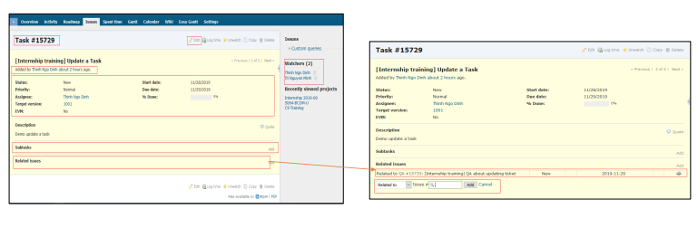

# 1: Redmine
  - Redmine là một công cụ sử dụng để quản lý dự án, nhiệm vụ.
  - Redmine có thể giúp PM / Leader theo dõi hoạt động của thành viên.
  

  
- Đây là tính năng quản lý vé.

- Redmine – Detail ticket & Update Ticket

