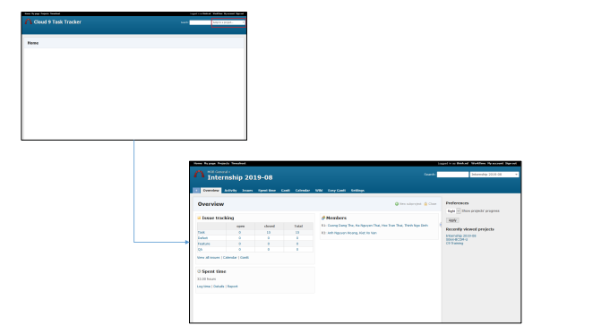
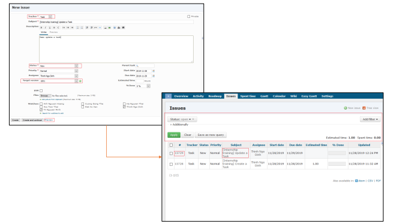
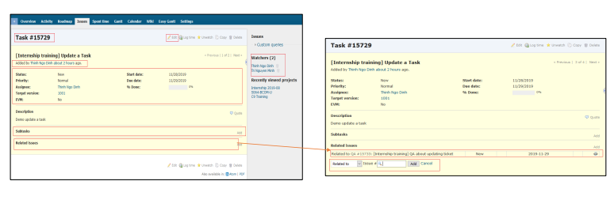
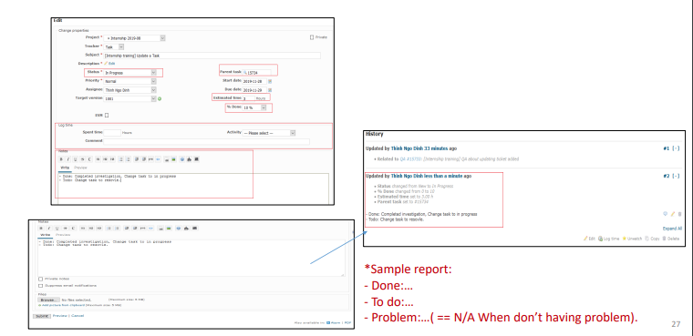
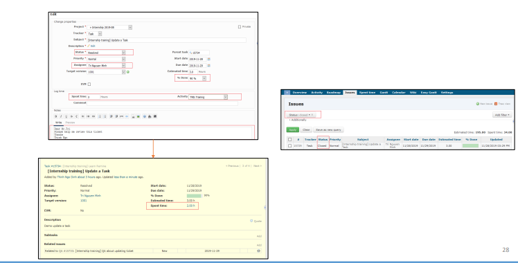
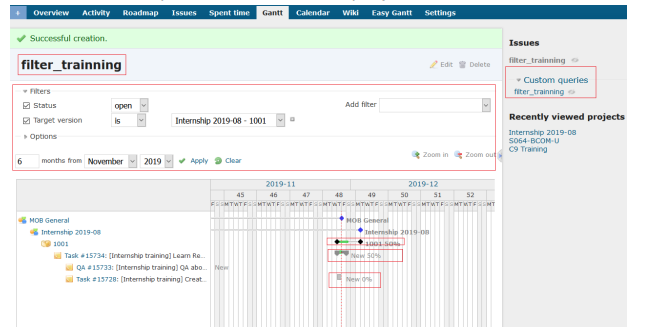
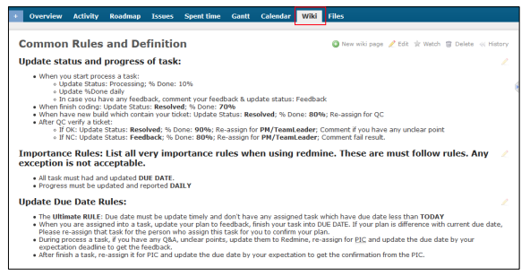

# 1: Redmine
  - Redmine là một công cụ sử dụng để quản lý dự án, nhiệm vụ.
  - Redmine có thể giúp PM / Leader theo dõi hoạt động của thành viên.
  

  
- Đây là tính năng quản lý vé.

- Redmine – Detail ticket & Update Ticket

- Redmine – Update Ticket(In Progress)

- Redmine – Update Ticket(Resolved & Closed)

- Redmine – Gantt
  + Gantt là một tính năng giúp theo dõi tiến độ của dự án.

- Redmine – Wiki
  + Main document, thông số kỹ thuật của dự án sẽ được mô tả ở đây.. 

# 2: Redmine Exercises
  - Yêu cầu: 
    + Người lãnh đạo(Leader) tạo nhiệm vụ với chủ đề: [Đào tạo](Training) Đào tạo Quy trình làm việc(Training Working process), Thư(Mail), Redmine, Auto Office.
    + Mô tả(Description):
      + Mỗi thành viên Tạo một "Request Meeting Room", “Facility request”, “Leave request”.
      + Viết email với nội dung là thông tin liên hệ của tất cả các thành viên trong nhóm và gửi cho trưởng nhóm. Tạo bộ lọc nhóm cho email.
      + Ảnh chụp màn hình xử lý quá trình tạo và kết quả (bao gồm kết quả từ người phê duyệt).
    +  Nhóm trưởng(Leader) tạo nhiệm vụ phụ theo mô tả và phân công cho thành viên (mỗi thành viên sẽ có 1 nhiệm vụ).
    +  Thành viên trong nhóm làm nhiệm vụ và cập nhật nhiệm vụ, nếu gặp sự cố, hãy tạo QA và phân công cho leader.
    +  Nếu Trưởng nhóm nhận được QA, một điều không thể giải quyết -> hãy communicate with trainer để được trợ giúp.
    +  Vui lòng làm theo sơ đồ quy trình làm việc (slide 4) để biết công việc.

# 3: Atlas - Introduction(giới thiệu Atlas)
  - Công cụ này dùng để dịch các tài liệu từ tiếng Nhật sang tiếng Việt tự động (nhưng độ chính xác không cao, chỉ mang tính chất tham khảo).
  - Các định dạng tài liệu được hỗ trợ: txt, csv, xls, doc, ppt (ngoại trừ pdf).
  - Yêu cầu bộ phận BECOM nếu bạn muốn dịch tài liệu để xem trước (trong khi chờ BSE dịch nó)
  - Để biết chi tiết về cách sử dụng công cụ này, hãy tham khảo tài liệu đào tạo Atlas của BECOM department.
