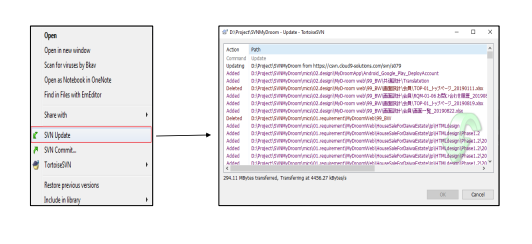
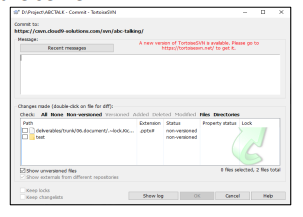
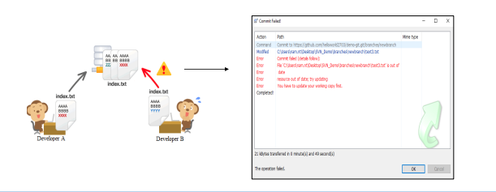
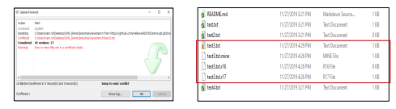

# 1: SVN - Cài đặt
- Bạn có thể cài đặt Tortoise SVN
  Mở ổ đĩa chưa file exe tài về chạy và cài đặt file.
# 1.1: SVN (Subversion)
## 1.1.1: SVN là gì?
  - SVN là một phần mềm Hệ thống kiểm soát phiên bản tập trung (CVCS) được phân phối theo giấy phép nguồn mở.
  - Subversion:  quản lý các tệp và thư mục cũng như những thay đổi được thực hiện đối với chúng,over time(mọi thời gian).
  - Cho phép bạn khôi phục các phiên bản cũ hơn của dữ liệu hoặc kiểm tra lịch sử của dữ liệu của bạn đã thay đổi như thế nào.
## 1.1.2: Một số khái niệm cần nắm.
  - Repository(Kho lưu trữ): Repository là trái tim của bất kỳ hệ thống kiểm soát phiên bản nào. Nó là nơi trung tâm, nơi các nhà phát triển lưu trữ tất cả công việc của họ. Repository không chỉ lưu trữ các tệp mà còn cả lịch sử. Repository được truy cập qua mạng, hoạt động như một máy chủ và công cụ kiểm soát phiên bản hoạt động như một máy khách.
  - Working copy(Phiên bản làm việc): là ảnh chụp nhanh của Repository. Repository được chia sẻ bởi tất cả các nhóm, nhưng mọi người không trực tiếp sửa đổi nó. Thay vào đó mỗi nhà phát triển kiểm tra bản sao làm việc. Bản sao làm việc là một bản riêng tư nơi làm việc nơi các nhà phát triển có thể thực hiện công việc của họ, còn lại tách biệt với phần còn lại của đội.
  - Branches: Hoạt động Branches được sử dụng để tạo ra một dòng phát triển khác. Nó rất hữu ích khi bạn muốn quá trình phát triển của mình chia thành hai nhiều hướng khác nhau. Ví dụ: khi bạn phát hành phiên bản 5.0, bạn có thể muốn tạo một nhánh để có thể duy trì sự phát triển của các tính năng 6.0 tách biệt khỏi bản sửa lỗi 5.0.
# 1.2: Cách hoạt động của Subversion:
.PNG)
# 1.3:Bắt đầu với TortoiseSVN
  - Check out: Để có được một bản sao hoạt động, bạn cần Check out từ một repository(kho). Chọn một thư mục trong windows explorer nơi bạn muốn đặt bản sao làm việc của bạn Nhấp chuột phải để bật context menu và chọn lệnh TortoiseSVN → Checkout sẽ trả về hộp thoại sau:
  

  - Update: Cập nhật bản sao làm việc của bạn với các thay đổi từ SVN Repository. Đến
cập nhật, chọn files / hoặc thư mục(directories) bạn muốn, nhấp chuột phải và chọn
TortoiseSVN → Update trong context menu của explorer.

  - Committing Your Changes To The Repository: Gửi những thay đổi bạn đã thực hiện đối với bản sao làm việc của bạn được gọi là committing các thay đổi.Nhưng trước khi bạn commit bạn phải đảm bảo rằng bản sao làm việc của bạn được cập nhật.Bạn có thể sử dụng TortoiseSVN → Update để cập nhật trực tiếp. Hoặc bạn có thể sử dụng TortoiseSVN →  Check for Modifications đầu tiên. để xem tệp nào đã thay đổi cục bộ hoặc trên máy chủ.

  - Resolve Conflict(xảy ra xung đột): 
      + Khi SVN Client A thực hiện thay đổi nội dung của  index file và đã commited lên kho lưu trữ máy chủ SVN.
      + Sau đó, SVN Client B cũng thực hiện thay đổi nội dung của index file. Và bây giờ nếu B commited tệp này vào kho lưu trữ, xung đột sẽ xảy ra.

  - To resolve conflict(giải quyết xung đột):
    +  Cập nhật từ kho: SVN Update
    +  Mở tệp trong trình chỉnh sửa( editor) và chỉnh sửa kết quả cuối cùng bạn muốn. Ngoài ra, đối với mọi tệp xung đột Subversion đặt ba tệp bổ sung vào thư mục của bạn.

    +  Thực hiện commit giải quyết xung đột: commit lại.
    +  Bạn nên update từ kho lưu trữ(repository) để kiểm tra và giải quyết xung đột trước khi commit.

